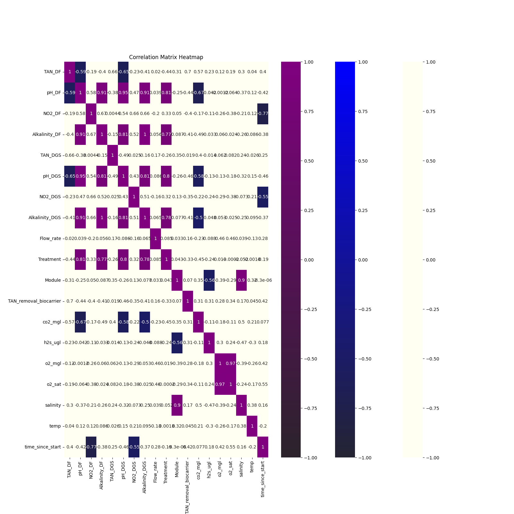
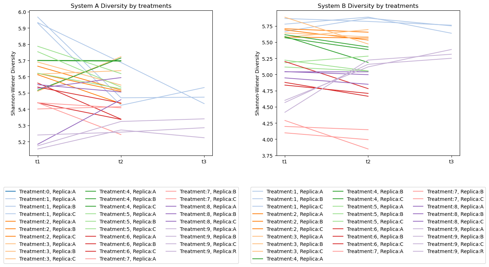
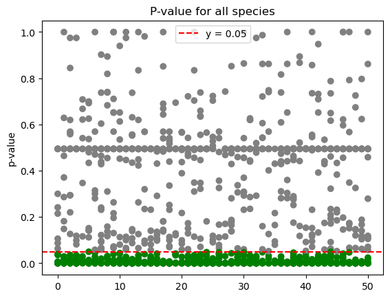
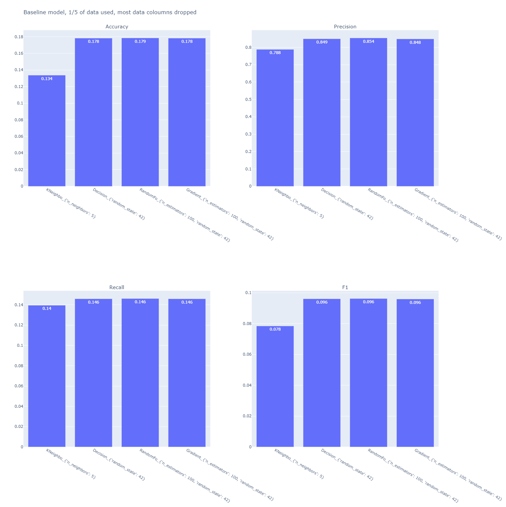
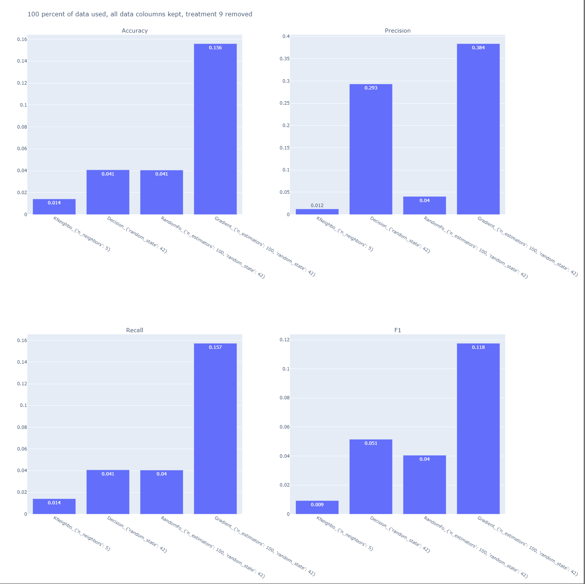

# Bio datathon UiB 

# Introduction:

### We were presented with two files:

**abundance_table.csv** which contains the percentage of DNA for each species found in different samples which have been given different treatments across several replicas.

**env_parameter_sample.csv** which contains the environmetal conditions for samples.

# Initial exploration:

Making a correlation plot over all values in the env_parameter_sample file can show the correlation between variables.

Purple = high positive correlation

White = low correlation

Blue = high negative correlation

We can see that some of the variables in the env_paramter_sample file have high degrees of correlation, but most variables no do not correlate.

# What we want to answer

The instructions were pretty open regarding what we could do with the data. For us, it was interesting to find out how the **different treatments** impact the life thats in it, regarding the **concentrations of dna** found.

Initially, we thought about it broadly, hence we asked ourselves:

## **How is the biodiversity impacted by treatment?**

First we had to define a measure of diversity.

Thanks to chatGPTs recomendation we found the **Shannon-Wiener Diversity Index (H').** Which is a measure used to measure the diversity of species in a community.

This is defined by the equation **H = -Σpi * ln(pi)** where pi is the proportion of each individual in the community.

This is what we found:

We can see see some treatments, such as treatment 1 that seem to have a diferent behaviour in system A than B. Also it is interesting to see how indeed the replicas have similar values and hence, behave similarly.

## **How do the different treatments impact the populations?**

Again, looking at the dna percentage **by specie** in the samples we attempted to discover if:

 1. Treatments overall affect species population
 2. What treatments affect the most

As a simple measure of what each population was doing in each sample we applied linear regression to output a slope, which would serve as an indicator of growth/decrease and its speed.
Our dataset looked like this:
 

***[1.]** Do treatments overall affect species population?*

In order to determine **how much were the treatments relevant in the changes of population trend(slope)** we performed an **ANOVA analysis**. This way we can get a statistical significance "confidence" value regarding if a concrete specie is affected by the treatments.

Before starting though, we had to make sure the following, as this is some **assumptions** this method makes on the data. It is essential in order to be able to **consider the results valid.**

*1. The observations are independent within and among groups.
2. The observations within each group are normally distributed.
3. The distributions from which the samples are drawn have the same finite variance.*

**What can we say about our data?**
*1. -> We have replicas, so therefore not really. We should only grab one replica of each.
2. -> We will assume this is true, that the dna is homogeniouslly distributed in the sample medium.
3. -> Again, as in 2 we will assume homogeneous medium.*

After removing replicas, this is the result we got for the ***Homo Sapiens Specie*.**
**p_value = 0.0011488636867922114**

Typically in ANOVA analysis a p_value of **0.05 is the threshold** to determine if there is a **statistical significance** or not. In this case it is **below, so we have some!**
Note: we utilized the function *f_oneway* from the *scipy statistics* package.

After this result, we continued to determine, **how does this affect all other species?** Hence, we did the exact same calculation for all 

In the above plot, each dot represents a different specie, they are randomly plotted on the canvas mantaining a y-value equal to the calculated p-value.

**What percent of species are significantly affected by the treatments?** --> 4.35%

---

**ML approach to steer formulating an hypothesis**: 

The purpouse of this part is to attempt to create a classifier that given the amount of DNA per species over the three values, can determine which treatment was used.

Example data row:

| id | Specie | System | Treatment | Replica | t1 | t2 | t3 | slope | var | std | mean |
|----|--------|--------|-----------|---------|----|----|----|-------|-----|-----|-----|
| Rhodocytophaga_rosea_B2_A | Rhodocytophaga rosea | 157223 | B | 2 | A | 0.146843 | 0.168919 | 0.0 | -0.073421 | 0.00562 | 0.13 | 0.12

The coloumns that contained alphabetic sata such as "Treatment" being "B" was transformed into numeric values.

Initally, the data was skewed, and this proved to be a big issue. Upon initial prediciting, the model simply guessed the 9th treatment much too often, but it makes sense since this is a valid "strategy". 

After removing the 9th treatment to see if the model could improve, it made the model slightly worse. So even with balanced treatment data, the model had a lot of issues predicting the correct treatment from the data.

| Treatment | Count | Percentage |
|-----------|-------|------------|
| 1         | 73392 | 10.714     |
| 2         | 73392 | 10.714     |
| 3         | 73392 | 10.714     |
| 4         | 73392 | 10.714     |
| 5         | 73392 | 10.714     |
| 6         | 73392 | 10.714     |
| 7         | 73392 | 10.714     |
| 8         | 73392 | 10.714     |
| 9         | 97856 | 14.285     |

Treatment 9 is occouring much more often than the other treatments.

After attempting to classify which treatment comes from what values, it proved to be a bit of an issue. 

Generally, the models came up with an accuracy around 18%, this is a reflection of when the model guesses, what is the chance it guesses right? An accruacy of 18% is only slightly better than simply guessing treatment 9 every time.

After removing treatment 9, the accuracy fell to 0.156. This means that the model is able to sometimes guess the treatment from the data, however the accuracy falling when removing treatment 9, simply shows the model guesses treatment 9 too often.

Overall, these models proved that simpy determining treatment from the amount of dna from each species, is a difficult task, and perhaps since DNA percent differs so much between each species, there may not be a clear correlation.

## **How does treatment affect water conditions?**
In order to answer this question we attempted to create some simple ML classifiers, SVM and KNN. They attempted to classify the applied treatment by using the water conditions as features. 
The idea is that if we are able to make a model with a decent accuracy that **could** mean that there is some relation between  them.

**Results:**
We didn't manage to classify. We cannot conclude from this that the inability to classify means that there is no relation so we could consider it non conclusive. Anyhow, talking to *Natacha* she mentioned that the scientists taking the samples were trying to make the conditions stable, which aligns with having no relation between them.

## What water conditions are related to the increase or decrease of certain species?

**Note: What water conditions?**
- TAN_DF
- pH_DF
- NO2_DF
- Alkalinity_DF
- TAN_DGS
- pH_DGS
- NO2_DGS
- Alkalinity_DGS
- Flow_rate
- TAN_removal_biocarrier
- co2_mgl
- h2s_ugl
- o2_mgl
- o2_sat
- salinity
- temp
---
We computed the **correlation** for each of the **water conditions** with the **percentage of dna** per sample, per species. A lot of data.
We wanted to do this in order to later on, be able to analyze the correlation of each water condition with the dna %:

- per system 
- per treatment

We will look per water condition the **distribution** of these correlations in each **system group** and **treatment group**. We **could** even analyse for **specific species** we were interested on*
We could even analyse per sample the different replicas distribution, in theory they should be pretty packed together. 

**Per System:**

<imgs super plot<

We can see that

**Per Treatment:**
<imgs super plot

We can see that